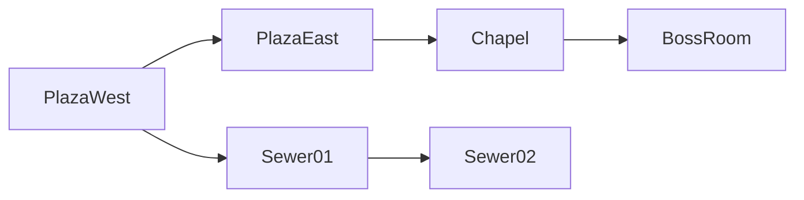

# Проектирование связанного мира (Blasphemous-style)

Руководство описывает, как проектировать большие локации и «бесшовные» переходы между ними. Дополняет [level-authoring.md](./level-authoring.md), где описан текущий pipeline одного Tiled-уровня.

## Что делает Blasphemous (и чем это отличается от текущего проекта)

В *Blasphemous* мир — это **сеть связанных комнат (экранов)**, а не одна линейная цепочка «уровень → экран победы → следующий уровень».

| Аспект | Blasphemous / metroidvania | Текущий platformer |
|--------|---------------------------|-------------------|
| Единица контента | Комната / зона | Один `levelId` (вся карта) |
| Переход | Дверь, проход, лифт — игрок остаётся в игре | `level_exit` → fade → `LevelCompleteScene` → reload |
| Камера | Часто clamp к **границам комнаты**, не всего мира | Clamp к **границам всей карты** (`level.bounds`) |
| Размер | Много комнат по ~1–3 экрана; мир огромный в сумме | `level-01`: 40×20 тайлов (1280×640 px) |
| Сохранение | Позиция + текущая комната + открытые двери | `levelId` + checkpoint |
| Навигация | Нелинейная, backtracking | `LEVEL_PROGRESSION`: линейный список |

Цифра **768×608** часто всплывает как размер «экрана» в классических metroidvania (примерно viewport SNES/GBA). У нас viewport **1920×1080** — при проектировании ориентируйтесь на него: одна «комната» обычно 1–2 ширины экрана, не обязательно 768 px.

---

## Три стратегии проектирования

### Стратегия A — Одна огромная карта на зону (простой старт)

**Идея:** один `.tmx` на крупную локацию (весь квартал, весь соборный неф). Игрок свободно ходит; «переход локации» — просто дойти до другого конца карты.

```
┌────────────────────────────────────────────────────────────┐
│  zone-cathedral.tmx  (например 200×80 тайлов = 6400×2560)  │
│  [площадь]────[неф]────[алтарь]────[крипта-вход]            │
└────────────────────────────────────────────────────────────┘
```

**Плюсы:** настоящая бесшовность без кода переходов; один JSON; проще первая итерация.

**Минусы:** Tiled тормозит на очень больших картах; тяжёлый JSON; сложно командная работа; вся зона в памяти сразу.

**Когда выбирать:** прототип одной большой области, мало зон, solo-разработка.

**В Tiled:** увеличивайте `Map → Map Properties → width/height`. Следите, чтобы `ground` / `decor` / `objects` оставались. Камера уже следует за игроком по всем `level.bounds`.

---

### Стратегия B — Граф комнат (ближе всего к Blasphemous) ★ рекомендуется

**Идея:** каждая **комната** — отдельный Tiled-файл умеренного размера. Переходы — объекты-двери с ссылкой «куда вести». Runtime подгружает соседнюю комнату и ставит игрока у парной двери.

```
room-plaza-west.tmx  ──door→east──►  room-plaza-east.tmx
        │                                      │
        └──door→down──►  room-sewer-01.tmx ◄──┘
```

**Плюсы:** удобно редактировать; масштабируется на весь мир; можно грузить только соседей; как в большинстве metroidvania.

**Минусы:** нужна новая игровая логика (см. раздел «Что потребуется в коде»); стыковка дверей требует дисциплины.

**Когда выбирать:** цель — мир как в Blasphemous, Hollow Knight, Symphony of the Night.

#### Как проектировать комнаты в Tiled

1. **Именование:** `{зона}-{комната}.tmx`, например `alburquerque-bridge.tmx`, `alburquerque-chapel.tmx`.
2. **Размер комнаты:** ориентир 40–120 тайлов по ширине (при 32 px → 1280–3840 px), 15–40 по высоте. Часто 1–2 экрана по горизонтали.
3. **Слой `objects`:** вместо (или вместе с) `level_exit` — объекты типа `door` / `room_transition`:

| Property | Type | Пример | Назначение |
|----------|------|--------|------------|
| `targetRoom` | string | `alburquerque-chapel` | id целевой карты (без `.json`) |
| `targetDoor` | string | `from-bridge-west` | id двери на целевой карте |
| `facing` | string | `right` | направление выхода игрока |
| `fadeMs` | int | `150` | длительность затемнения (0 = без fade) |

4. **Парные двери:** у каждого перехода две записи в двух `.tmx`:

```
room-A.tmx                          room-B.tmx
┌──────────────┐                    ┌──────────────┐
│         [D1]─┼── targetRoom=B ───►│─[D2]         │
│  id=to-B     │    targetDoor=D2   │ id=from-A    │
└──────────────┘                    └──────────────┘
```

5. **`player_spawn`:** в каждой комнате один spawn для **первого входа** (новая игра, save). При переходе через дверь позиция берётся от `targetDoor`, не от spawn.

6. **Границы камеры:** на слое `objects` прямоугольники `camera_bounds` (будущий тип) **или** комната = вся карта, пока код не поддерживает sub-bounds.

#### Карта мира (для себя, не обязательно в runtime)

Держите схему связей отдельно — в FigJam, Mermaid, таблице:



Так вы не потеряетесь в десятках `.tmx`.

---

### Стратегия C — Гибрид: зона = большая карта + внутренние «комнаты» для камеры

**Идея:** одна `.tmx` на район, но на object layer — прямоугольники `room_zone`, задающие clamp камеры. Переход между зонами внутри файла — пересечение `room_zone` без загрузки.

**Плюсы:** бесшовность внутри зоны; меньше стыков дверей.

**Минусы:** файл всё равно растёт; переход между **районами** всё равно нужен как в стратегии B.

**Когда выбирать:** крупные вертикальные области (башня, пещера) с плавным скроллом внутри.

---

## Сравнение стратегий

| Критерий | A: мега-карта | B: граф комнат | C: гибрид |
|----------|---------------|----------------|-----------|
| Бесшовность | ★★★ | ★★ (с коротким fade) | ★★★ внутри зоны |
| Размер мира | ограничен | неограничен | средний |
| Сложность в Tiled | низкая | средняя | высокая |
| Сложность в коде | минимальная (уже есть) | новая система переходов | sub-bounds камеры |
| Близость к Blasphemous | средняя | высокая | высокая |

---

## Практический workflow (стратегия B)

### Шаг 1. Набросок региона

- Выберите **регион** (например «Альбуркерке»).
- Нарисуйте 5–10 комнат на бумаге / в схеме: где платформы, босс, save, shortcut.
- Отметьте **тип перехода**: дверь (fade), яма (падение вниз, без fade), лифт.

### Шаг 2. Создайте «хаб»-комнату

- Скопируйте `level-01.tmx` → `alburquerque-plaza.tmx`.
- Упростите до одной площадки 60×25 тайлов.
- Разместите `player_spawn`, один `checkpoint`, 2–3 объекта `door` на краях.

### Шаг 3. Соседние комнаты

- Для каждой двери — новый `.tmx`.
- Выровняйте **высоту пола** на стыке (одинаковый Y платформы у парных дверей).
- Зеркальте горизонталь: выход `right` на A → вход `left` на B.

### Шаг 4. Конфиг графа (будущий `world-graph.ts`)

```ts
// Пример целевой структуры (ещё не в репозитории)
export const WORLD_GRAPH = {
  'alburquerque-plaza': {
    entrySpawn: 'player_spawn',
    doors: {
      'to-chapel': { targetRoom: 'alburquerque-chapel', targetDoor: 'from-plaza' },
    },
  },
} as const;
```

Пока графа нет — дублируйте связи в properties объектов Tiled; парсер потом прочитает их из JSON.

### Шаг 5. Playtest по одной связи

- Проверяйте не весь мир сразу, а цепочку из 2–3 комнат.
- Смотрите: нет ли щели между полом; камера не показывает пустоту за стеной; spawn не внутри тайла.

---

## Координаты и «бесшовность»

### Визуальная непрерывность

- Используйте **один tile size (32 px)** и общие тайлсеты между комнатами одного региона.
- Платформа у двери на карте A и у парной двери на B должна быть на **одной мировой высоте** (если переход горизонтальный).
- Декор у края (факел, колонна) дублируйте симметрично — глаз не заметит смену файла.

### Игровая непрерывность

- **Не перезагружайте GameScene** при двери — только смените tilemap и сдвиньте игрока (целевое поведение).
- Короткий **fade 100–200 ms** скрывает подгрузку; Blasphemous часто использует именно это, а не мгновенный cut.
- Сохраняйте **состояние комнаты** (убитые враги, открытые двери) по `roomId`, иначе backtracking будет раздражать.

### Камера

Сейчас: `setBounds(0, 0, level.bounds.width, level.bounds.height)`.

Для комнатного стиля:

- При входе в комнату: clamp к размеру **текущей комнаты**, не всего мира.
- При двери вправо: камера может **упереться в правый край** комнаты A, fade, snap к левому краю комнаты B — создаётся иллюзия одного пространства.

---

## Что уже есть в коде и чего не хватает

### Уже есть

- Загрузка Tiled JSON, тайлы, коллизии, объекты.
- Камера с smooth follow и clamp к bounds.
- Checkpoint / respawn.
- Сохранение `levelId` в save.

### Нужно для Blasphemous-style (отдельный change)

| Фича | Зачем |
|------|--------|
| `door` / `room_transition` object type | Переход без Level Complete |
| `RoomDefinition` + `WorldGraph` | Связи комнат, spawn у двери |
| Hot-swap tilemap в `GameScene` | Не выходить в LevelCompleteScene |
| `currentRoomId` в save | Вернуться в ту же комнату |
| Per-room camera bounds | Камера как в metroidvania |
| Room state (enemies defeated, doors open) | Backtracking |
| (Опционально) preload соседних комнат | Меньше лаг на fade |

`level_exit` и `LevelCompleteScene` можно оставить для **финала акта** или демо-уровней; для мира они не основной инструмент.

---

## Рекомендация для вашего этапа

Вы ещё не проектировали уровень — **не начинайте с одной гигантской карты всего мира**.

1. Спроектируйте **регион из 3–5 комнат** по стратегии B на бумаге.
2. Соберите их как отдельные `.tmx` с парными дверями (properties вручную).
3. Пока нет кода переходов — **временно** склейте 2–3 комнаты в одну карту (стратегия A) для playtest геймплея.
4. Когда будете готовы к коду — заведите OpenSpec change `interconnected-world` с `door`, hot-swap и save по `roomId`.

Так вы не блокируете дизайн на текущей архитектуре и сразу закладываете правильную модульность.

---

## Архитектурные правила переходов между комнатами

Реализация hot-swap комнат и все будущие изменения, связанные с графом мира, **обязаны** следовать правилам из OpenSpec change `interconnected-world`:

- [design.md — Rule 1–10](../openspec/changes/interconnected-world/design.md#architectural-rules-for-room-transitions)

Кратко: переходы выполняются **внутри** `GameScene` (без `scene.restart`), план перехода строит use case `TransitionThroughDoor`, spawn у парной двери — в `RoomTransitionRules`, save хранит `currentRoomId`, `level_exit` по-прежнему ведёт на Level Complete.

---

## Связанные документы

- [level-authoring.md](./level-authoring.md) — слои, объекты, экспорт Tiled
- `openspec/specs/level-pipeline/spec.md` — текущий контракт загрузки
- `openspec/specs/level-complete-flow/spec.md` — линейное завершение уровня (не room transition)
